# RH Management System

This repository contains a complete RH (Resource Handling) management system, which includes:

- **ASP.NET Core 8 Web API** for the backend.
- **Angular 18** for the frontend.
- **Flask-based Chatbot** for additional functionality.

## Preview

Here are some screenshots of the application:

<div align="center">
    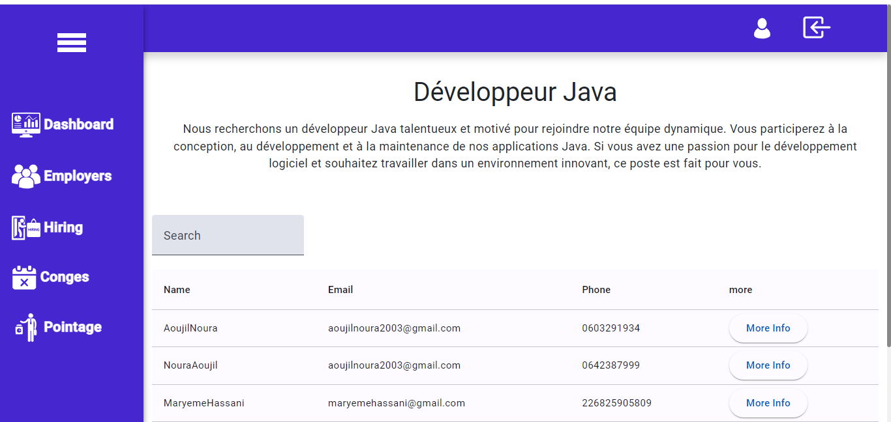
    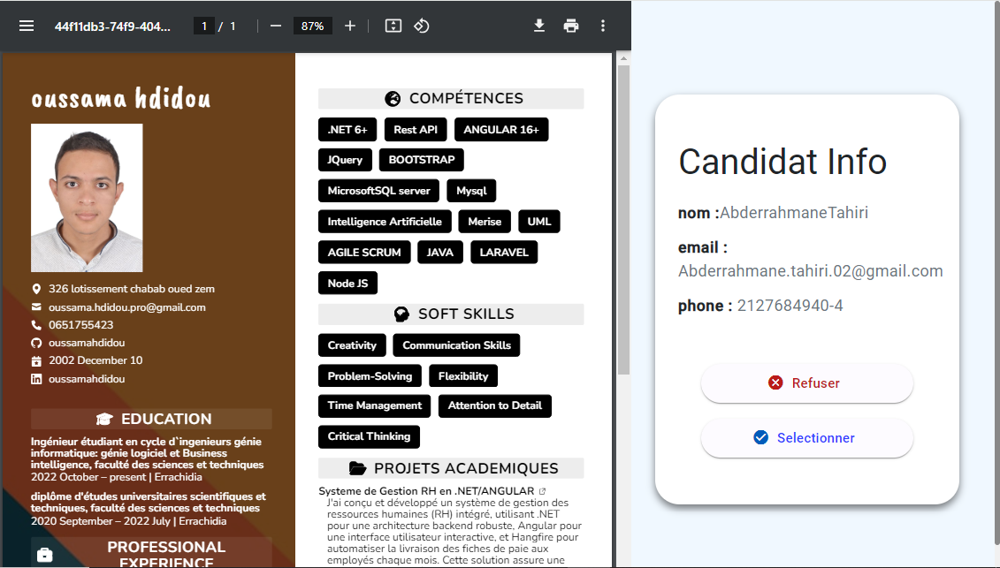
</div>

<div align="center">
    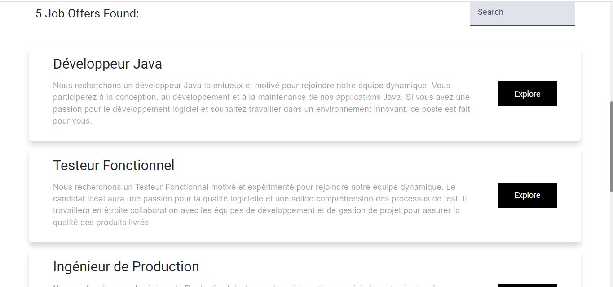
    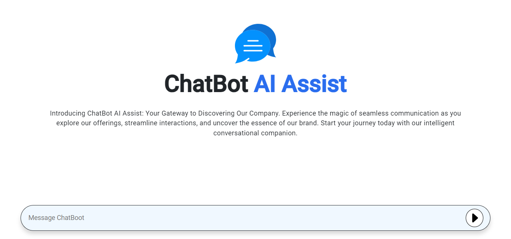
</div>

<div align="center">
    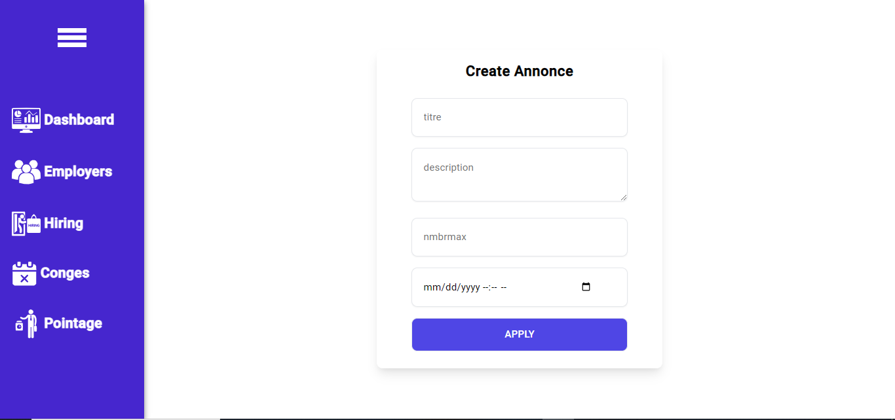
    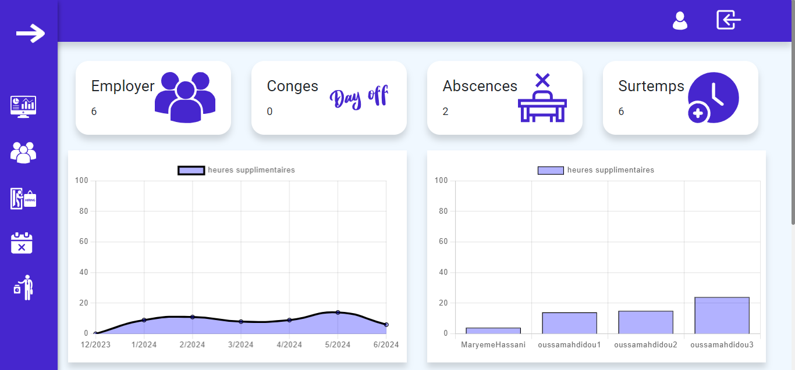
</div>

<div align="center">
    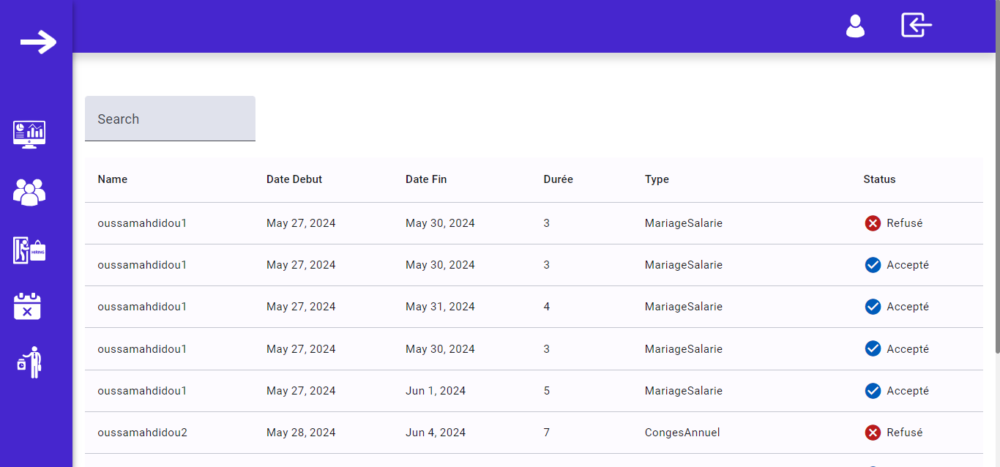
    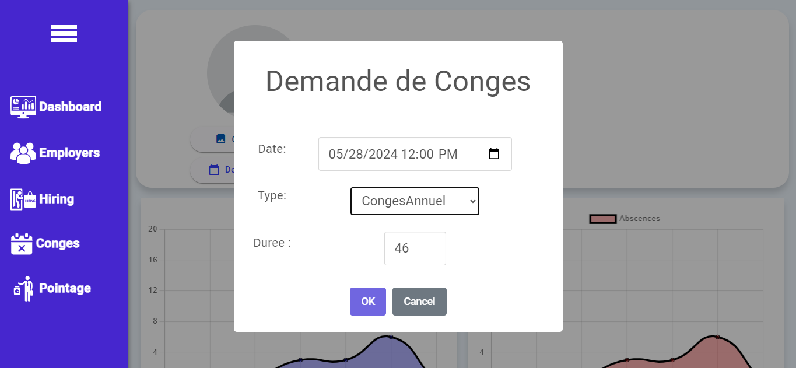
</div>

<div align="center">
    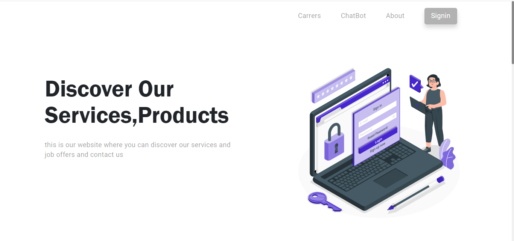
    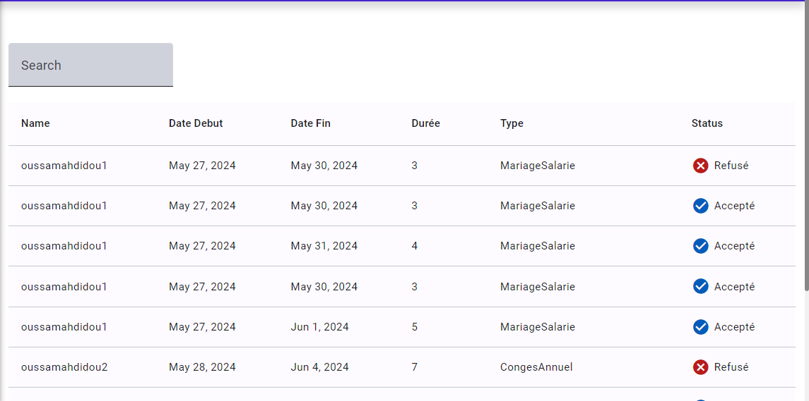
</div>

<div align="center">
    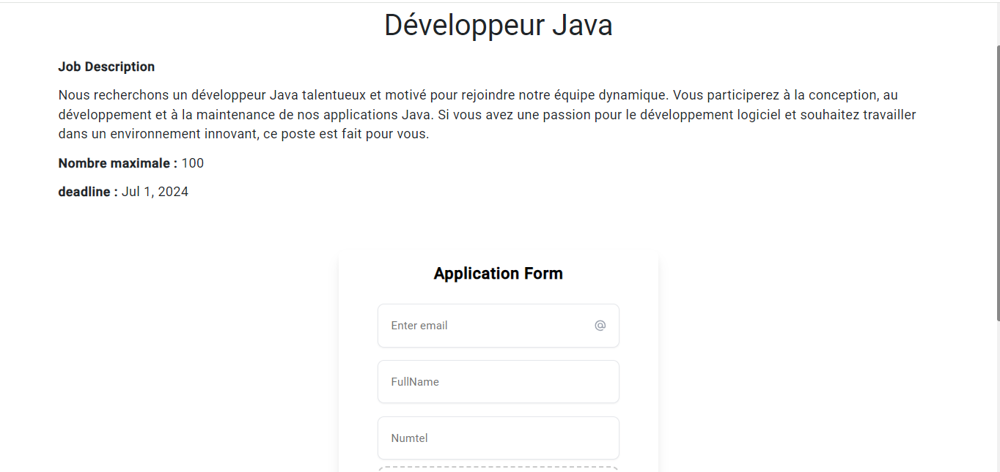
    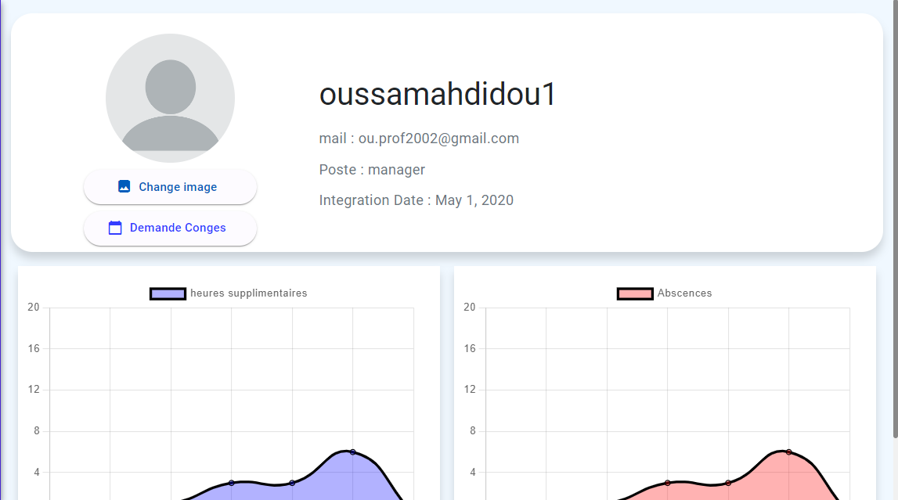
</div>

<div align="center">
    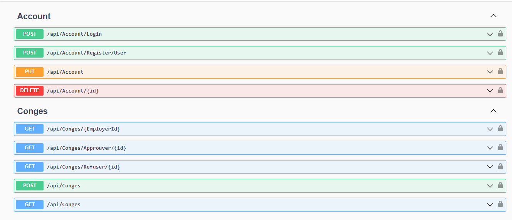
</div>
## Table of Contents

- [Prerequisites](#prerequisites)
- [Cloning the Repository](#cloning-the-repository)
- [Backend Setup (ASP.NET Core 8)](#backend-setup-aspnet-core-8)
- [Frontend Setup (Angular 18)](#frontend-setup-angular-18)
- [Chatbot Setup (Flask)](#chatbot-setup-flask)
- [Running the Application](#running-the-application)

## Prerequisites

Before you start, make sure you have the following installed:

- **Git**
- **Node.js and npm**
- **.NET Core SDK 8**
- **Python 3.x** and `pip`
- **Angular CLI**
- **Flask**

## Cloning the Repository

First, clone the repository from GitHub:

```bash
git clone https://github.com/oussamahdidou/RH-system-management-and-ChatBot.git
cd RH-system-management-and-ChatBot
```

## Backend Setup (ASP.NET Core 8)

1. Navigate to the `backend` directory:

   ```bash
   cd api
   ```

2. Restore the .NET dependencies:

   ```bash
   dotnet restore
   ```

3. Build the project:

   ```bash
   dotnet build
   ```

4. Update the database (if applicable):

   ```bash
   dotnet ef database update
   ```

5. Run the backend server:

   ```bash
   dotnet run
   ```

The backend should now be running on `https://localhost:5111`.

## Frontend Setup (Angular 18)

1. Navigate to the `frontend` directory:

   ```bash
   cd ../client
   ```

2. Install the Angular dependencies:

   ```bash
   npm install
   ```

3. Run the frontend server:

   ```bash
   ng serve
   ```

The frontend should now be running on `http://localhost:4200`.

## Chatbot Setup (Flask)

1. Navigate to the `chatbot` directory:

   ```bash
   cd ../chatbot
   ```

2. Create and activate a virtual environment:

   ```bash
   python -m venv venv
   source venv\Scripts\activate`
   ```

3. Install the Python dependencies:

   ```bash
   pip install -r requirements.txt
   ```

4. Run the Flask server:

   ```bash
   flask run
   ```

The chatbot should now be running on `http://localhost:5002`.

## Running the Application

To run the entire application, you need to have all three components (backend, frontend, and chatbot) running simultaneously.

1. Open three terminal windows or tabs.
2. In the first terminal, start the backend by running `dotnet run` in the `backend` directory.
3. In the second terminal, start the frontend by running `ng serve` in the `frontend` directory.
4. In the third terminal, start the chatbot by running `flask run` in the `chatbot` directory.

Now, you should be able to access the full application by navigating to `http://localhost:4200` in your web browser.
